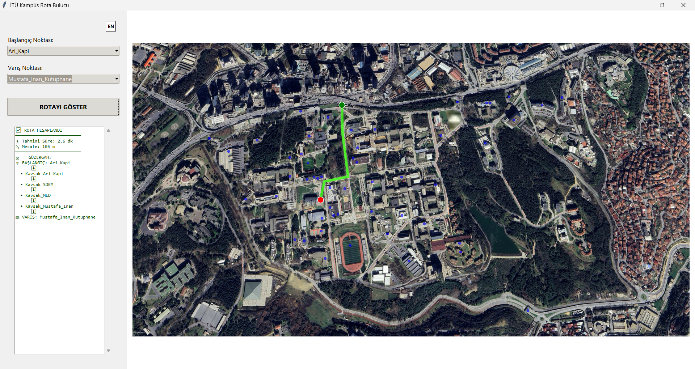

# 📍 ITU Campus Navigation App / İTÜ Kampüs Rota Bulucu



<p align="center">
  <a href="#-english">🇺🇸 English</a> | <a href="#-türkçe">🇹🇷 Türkçe</a>
</p>

---

<div id="-english"></div>

## 🇺🇸 English

### 📖 About The Project
This project is a desktop application designed to find and visualize the **shortest path** between buildings at the **Istanbul Technical University (ITU) Ayazağa Campus**.

It combines the performance of **C** for backend algorithms with the visual capabilities of **Python** for the frontend. The project demonstrates a hybrid software architecture using file-based inter-process communication (IPC).

### ✨ Key Features
* **Hybrid Architecture:** C backend for graph processing & Python (Tkinter) for GUI.
* **Pathfinding Algorithm:** Implements **Dijkstra's Algorithm** to calculate the shortest route.
* **Interactive Visualization:** High-resolution map plotting with **Matplotlib**.
* **Real-time Metrics:** Calculates estimated walking time and distance.
* **Bilingual Support:** Switch between English (EN) and Turkish (TR) dynamically.
* **Coordinate Calibration:** Custom tools to map real-world nodes to pixel coordinates.

### 🛠️ Built With
* **C:** Core logic, Graph implementation, File I/O.
* **Python:** GUI (Tkinter), Visualization (Matplotlib), Process Management.
* **Matplotlib:** For rendering the map and plotting the route.

### 🚀 Getting Started

#### Prerequisites
* GCC Compiler (for C code)
* Python 3.x
* Required Python libraries:
    ```bash
    pip install matplotlib
    ```

#### Installation & Running

1.  **Clone the repository**
    ```bash
    git clone [https://github.com/yigitdonmez/ITU-campus-navigation-app.git](https://github.com/yigitdonmez/ITU-campus-navigation-app.git)
    cd ITU-campus-navigation-app
    ```

2.  **Compile the C Backend**
    You must compile the C code first to generate the executable.
    ```bash
    gcc main.c graph.c -o main.exe
    ```
    *(On macOS/Linux use `-o main` instead of `main.exe`)*

3.  **Run the Application**
    ```bash
    python app.py
    ```

### 📂 Project Structure
* `main.c` / `graph.c`: The brain of the application. Handles graph data structures and the shortest path algorithm.
* `app.py`: The main entry point. Handles the GUI, file operations, business logic, and calls the C executable.
* `languages.py`: Dictionary for multi-language support.
* `tools/`: Helper scripts (e.g., for map calibration).
* `nodes.txt`: Database of coordinate points and building names.

---

<div id="-türkçe"></div>

## 🇹🇷 Türkçe

### 📖 Proje Hakkında
Bu proje, **İstanbul Teknik Üniversitesi (İTÜ) Ayazağa Kampüsü** içerisindeki binalar arasında **en kısa yolu** bulan ve görselleştiren bir masaüstü uygulamasıdır.

Proje, arka plan algoritmaları için **C** dilinin performansını, arayüz ve görselleştirme için **Python** dilinin esnekliğini birleştirir. Dosya tabanlı süreçler arası iletişim (IPC) kullanan hibrit bir yazılım mimarisi örneğidir.

### ✨ Temel Özellikler
* **Hibrit Mimari:** Grafik işlemler için C backend & Arayüz için Python (Tkinter).
* **Rota Algoritması:** En kısa rotayı hesaplamak için **Dijkstra Algoritması** kullanılmıştır.
* **İnteraktif Görselleştirme:** **Matplotlib** ile yüksek çözünürlüklü harita çizimi.
* **Anlık Veriler:** Tahmini yürüyüş süresi ve mesafe hesaplama.
* **Çift Dil Desteği:** İngilizce (EN) ve Türkçe (TR) arasında dinamik geçiş.
* **Koordinat Kalibrasyonu:** Gerçek dünya noktalarını piksel koordinatlarına eşleyen özel araçlar.

### 🛠️ Kullanılan Teknolojiler
* **C:** Ana mantık, Graf yapısı, Dosya işlemleri.
* **Python:** GUI (Tkinter), Görselleştirme (Matplotlib), Süreç Yönetimi.
* **Matplotlib:** Haritayı oluşturmak ve rotayı çizmek için.

### 🚀 Kurulum ve Çalıştırma

#### Gereksinimler
* GCC Derleyicisi (C kodu için)
* Python 3.x
* Gerekli Python kütüphaneleri:
    ```bash
    pip install matplotlib
    ```

#### Adım Adım Kurulum

1.  **Projeyi klonlayın**
    ```bash
    git clone [https://github.com/yigitdonmez/ITU-campus-navigation-app.git](https://github.com/yigitdonmez/ITU-campus-navigation-app.git)
    cd ITU-campus-navigation-app
    ```

2.  **C Kodunu Derleyin**
    Uygulamanın çalışması için önce C kodunu derleyip `main.exe` dosyasını oluşturmalısınız.
    ```bash
    gcc main.c graph.c -o main.exe
    ```
    *(macOS/Linux kullanıyorsanız `main.exe` yerine `-o main` yazın)*

3.  **Uygulamayı Başlatın**
    ```bash
    python app.py
    ```

### 📂 Proje Yapısı
* `main.c` / `graph.c`: Uygulamanın beyni. Graf veri yapılarını ve en kısa yol algoritmasını barındırır.
* `app.py`: Ana giriş noktası. Arayüzü yönetir, dosya işlemlerini yapar ve C programını çağırır.
* `languages.py`: Çoklu dil desteği için kelime veri tabanı.
* `tools/`: Yardımcı araçlar (örn. harita kalibrasyonu için).
* `nodes.txt`: Koordinat noktaları ve bina isimlerini tutan veritabanı.

---

### 📝 License / Lisans
Distributed under the MIT License. See `LICENSE` for more information.

Bu proje MIT Lisansı altında dağıtılmaktadır. Daha fazla bilgi için `LICENSE` dosyasına bakınız.